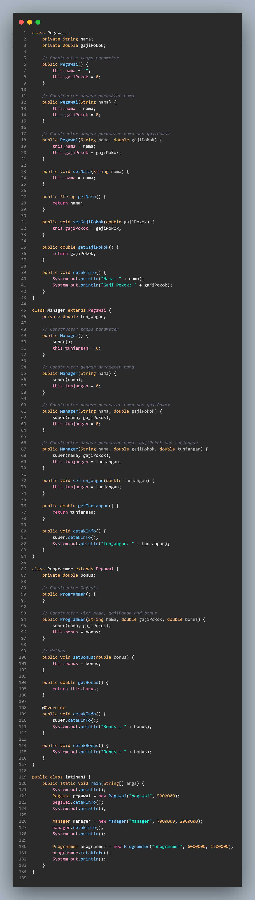
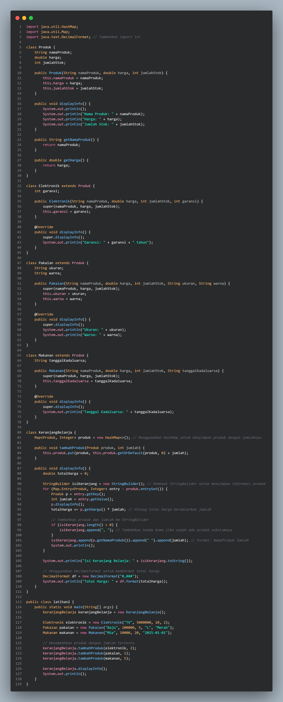

# Pemograman-Orientasi-Objek_latihan6

## `Nama : Agus Setiawan Nim : 312310597 Kelas : TI.23.A6`

 

# Soal

 

  

 

# Jawaban

 

## ● Latihan 1

 

### Kode

 

<a href=https://github.com/AgusSetiawn/Pemograman-Orientasi-Objek_latihan6/blob/main/Dokumentasi/Kode%20Java/latihan1.java><strong><i>Salin Kode</i></strong></a>

 

### Output

 

  

 

## ● Latihan 2

 

### Kode

 

<a href=https://github.com/AgusSetiawn/Pemograman-Orientasi-Objek_latihan6/blob/main/Dokumentasi/Kode%20Java/latihan2.java><strong><i>Salin Kode</i></strong></a>

 

### Output

 

  

 
